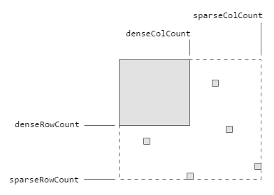

# blockm
When you use a library for matrix based computations you often have to know the
size of the matrix and if it is a dense or sparse matrix *before* you actually
create the matrix. `blockm` is a (prototype of a) matrix builder that allows you
to create a matrix just by filling the values and which can switch efficiently
between a sparse and dense representation during this filling process. It does
this by allocation a growing dense matrix block and fast array copying if the
fill rate exceeds a specific value:



## Usage
The usage of `blockm` is simple: you create a `MatrixBuilder`, set the values
via the `put` method, and create the final matrix by calling the `finish`
method:

```java
MatrixBuilder mb = new MatrixBuilder();
mb.put(row, col, value);
// ...
IMatrix m = mb.finish();
```

The return type of `finish` is an interface that is implemented by the dense
as well as the sparse matrix type. The concrete return type is a dense matrix
when the matrix exceeds a specific fill rate, otherwise a sparse matrix is
returned. This fill rate is the number of non-zero elements divided by the
total number of elements. The maximum fill rate that will result in a sparse
matrix can be passed as a constructor parameter to the matrix builder:

```java
// maxSparseFillRate = 0.2
MatrixBuilder mb = new MatrixBuilder(0.2);
// ...
```

The default value for the `maxSparseFillRate` parameter is `0.2`. Another
parameter that you can set via the constructor is the `checkpoint` parameter.
We do not test the fill rate and if a dense block needs to be allocated after
each `put` call but after a specific number of such calls. This number of calls
is what you can specify with the checkpoint parameter:

```java
// maxSparseFillRate = 0.2
// checkpoint = 5000
MatrixBuilder mb = new MatrixBuilder(0.2, 5000);
// ...
```
